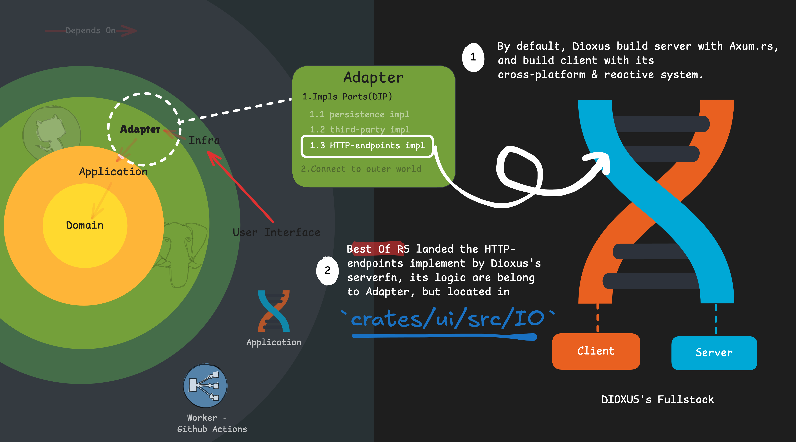

# Best Of RS's Architecture

> A multi-crate Rust practice of `Clean & Hexagonal Domain Driven Design`, combined Dioxus's fullstack.

## Clean Architecture

First, look at the high-level crate split:

```bash
crates/
 - adapters/               # Clean Core
 - app/                    # Clean Core
 - domain/                 # Clean Core
 - infra/                  # Clean Core
 - ui/                     # User Interface
 - worker/                 # User Interface
```

This architecture is inspired by [axum-clean-architecture by @Thodin](https://github.com/Thodin/axum-clean-architecture/), and adapted to Dioxus fullstack engineering practices.


Core dependency direction:

`domain <- app(application) <- adapter <- infra(infrastructure) <- user interface`

---

## Clean Core (DDD Core)

### 1. Domain Layer (`crates/domain/src`)

#### Tree

```bash
crates/domain/src
├── auth
├── error.rs
├── lib.rs
├── project
├── repo
└── snapshot
```

#### Layer Composition and Responsibilities

- `auth / project / repo / snapshot`: domain models split by business subdomain
- `error.rs`: domain-level error semantics
- `lib.rs`: domain module export boundary

The `Domain` layer carries domain semantics and invariants. It focuses on modeling, not orchestration or infrastructure details.

#### Typical Unit: `project`

```bash
crates/domain/src/project
├── entity.rs (Entity)
├── event.rs (Domain Event)
├── mod.rs
└── value_object.rs (Value Object)
```

---

### 2. Application Layer (`crates/app/src`)

#### Tree

```bash
crates/app/src
├── app_error.rs
├── auth
├── backup
├── common
├── lib.rs
├── prelude.rs
├── project
├── repo
└── snapshot
```

#### Layer Composition and Responsibilities

- `common`, `app_error.rs`: cross-use-case shared business logic and unified error semantics
- `auth / backup / project / repo / snapshot`: use-case modules by domain area
- `prelude.rs`: common exports for the application layer

The `Application` layer handles use-case orchestration. It depends on external capabilities through ports, not concrete infrastructure implementations.

#### Typical Unit: `project`

```bash
crates/app/src/project
├── command.rs (CQRS - command use cases)
├── event_handler.rs (domain-event-driven orchestration)
├── impls (Rich Domain Model-oriented implementations)
├── mod.rs
├── port.rs (Hexagonal Port)
└── query.rs (CQRS - query use cases)
```

---

### 3. Adapter Layer (`crates/adapters/src` + `crates/ui/src/IO`)

#### Tree

```bash
crates/adapters/src
├── auth
├── clock.rs
├── github.rs
├── lib.rs
├── persistence
└── prelude.rs
```

#### Layer Composition and Responsibilities

- `persistence`: storage adapter implementations
- `auth`: authentication/authorization-related adapters
- `github.rs`: external API adapter
- `clock.rs`: time capability adapter

The `Adapter` layer performs technical orchestration and boundary translation, implementing `Application` ports with concrete technologies.

Note: HTTP endpoint implementation code is in `crates/ui/src/IO`. This is intentional: physical location in `ui`, architectural ownership in `Adapter`.

#### Typical Unit: `persistence/psql`

```bash
crates/adapters/src/persistence/psql
├── backup.rs (data backup implementation)
├── db.rs (database connection implementation)
├── mod.rs
├── project_repo.rs (Project repository implementation)
├── repo_repo.rs (Repo repository implementation)
├── repo_tag_repo.rs (Tag repository implementation)
├── runtime.rs (runtime composition)
└── snapshot_repo.rs (Snapshot repository implementation)
```

---

### 4. Infrastructure Layer (`crates/infra/src`)

#### Tree

```bash
crates/infra/src
├── config
├── lib.rs
└── setup.rs
```

#### Layer Composition and Responsibilities

- `config`: configuration model and sources
- `setup.rs`: composition entry, initialization, and dependency injection
- `lib.rs`: infrastructure module exports

The `Infrastructure` layer handles system composition and startup only. It does not carry business rules.

#### Typical Unit: `config`

```bash
crates/infra/src/config
├── mod.rs (configuration module exports)
├── settings.rs (configuration structure definitions)
└── toml (environment config directory)
```

---

## User Interface (Presentation Layer)

`UI` and `Worker` both belong to `User Interface`, but they serve different interaction targets:
- `UI`: human-facing interaction
- `Worker`: scheduler/background execution

### 1. UI crate (`crates/ui/src`)

#### Tree

```bash
crates/ui/src
├── IO
├── components
├── impls
├── js
├── lib.rs
├── main.rs
├── root
└── types
```

#### Contents

- `main.rs`: UI/Web entry and fullstack server startup entry
- `root`: page layout and router structure
- `components`: reusable UI components
  - For KISS reasons, page-level components are also placed here for now, influenced by Next.js App Router-style organization
- `types`: front-end view model data structures
- `impls / js`: front-end implementation details

Notice: although `IO` is physically under `ui`, its HTTP endpoint logic is an Axum adapter and belongs to the `Adapter` layer architecturally.

See also:



#### SSR Fullstack Essentials

Dioxus v0.7.0+ provides convenient macros such as `#[post]` and `#[get]`. They provide a seamless fullstack development experience while keeping code organization clean. For details, see [Dioxus official docs](https://dioxuslabs.com/learn/0.7/essentials/fullstack/).

For cleaner SSR handling in complex components, this project uses a `mod-like` component blueprint:

```bash
crates/ui/src/components/**/exampleComp/
├── mod.rs                     # component
├── skeleton.rs                # loading fallback
├── error.rs                   # error fallback
├── hook.rs                    # private hook
├── context.rs                 # private context
├── style.css                  # optional, when Tailwind is not convenient
├── (optional)sub-Comp/        # optional nested component blueprint
```

The `IOCell` component is used to centralize SSR handling logic.

A minimal pure-component template (`compName.rs`) is also supported but it desn't need a word.

---

### 2. Worker crate (`crates/worker/src`)

#### Tree

```bash
crates/worker/src
└── main.rs
```

#### Contents

A lightweight application entry that reuses core capabilities. Currently it is used for a snapshot-related background task.

## Note
All diagrams are drawn in [Excalidraw](https://excalidraw.com).

