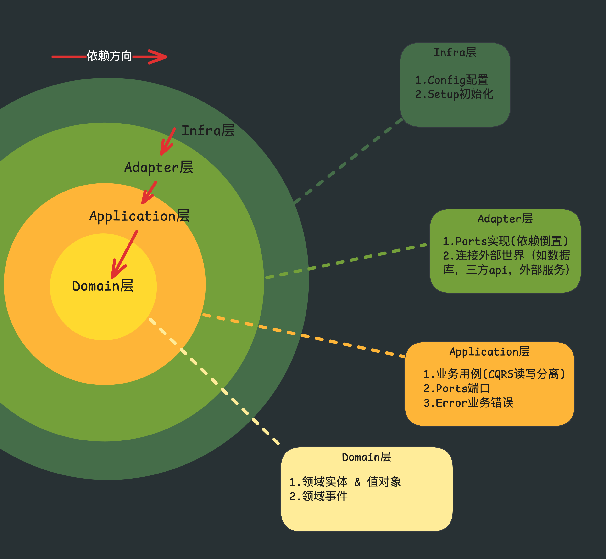
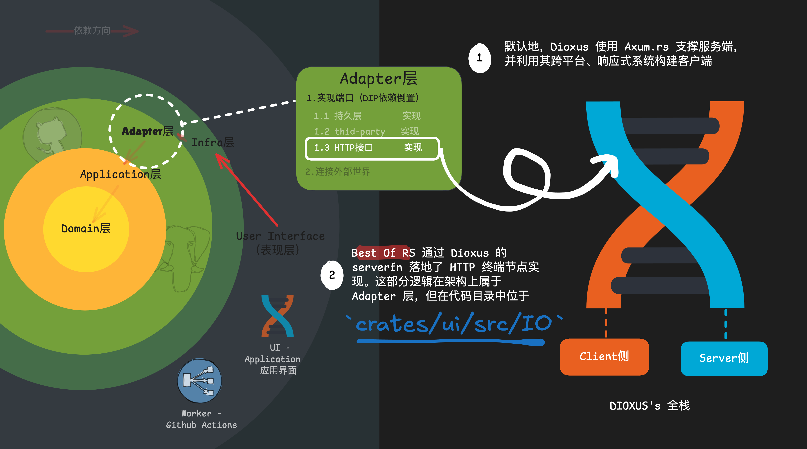

# Best Of RS 架构文档

> 一个基于 Rust 的 `Clean & Hexagonal Doamin Driven Design`架构, 结合dioxus全栈。

## Clean 架构

先看项目分层：

```bash
crates/
 - adapters/               # Clean Core
 - app/                    # Clean Core
 - domain/                 # Clean Core
 - infra/                  # Clean Core
 - ui/                     # User Interface
 - worker/                 # User Interface
```

本项目架构参考 [axum-clean-architecture by @Thodin](https://github.com/Thodin/axum-clean-architecture/)，并结合了 Dioxus fullstack 的工程实践。



核心依赖方向：

`domain <- app(application) <- adapter <- infra(infrastructure) <- user interface`

---

## Clean Core（DDD核心）

### 1. Domain Layer（`crates/domain/src`）

#### Tree图

```bash
crates/domain/src
├── auth
├── error.rs
├── lib.rs
├── project
├── repo
└── snapshot
```

#### Layer 构成与职责

- `auth / project / repo / snapshot`：按业务子域划分的领域模型
- `error.rs`：领域级错误语义
- `lib.rs`：领域模块导出边界

`Domain层`承载领域语义与业务不变式，只关心领域建模，不关心业务编排与技术实现。

#### 典型单元：以 `project` 为例

```bash
crates/domain/src/project
├── entity.rs (实体)
├── event.rs (领域事件)
├── mod.rs
└── value_object.rs (值对象)
```

---

### 2. Application Layer（`crates/app/src`）

#### Tree图

```bash
crates/app/src
├── app_error.rs
├── auth
├── backup
├── common
├── lib.rs
├── prelude.rs
├── project
├── repo
└── snapshot
```

#### Layer 构成与职责

- `common`、`app_error.rs`：跨 use case 的通用业务逻辑与统一错误语义
- `auth / backup / project / repo / snapshot`：不同领域用例（use cases）模块
- `prelude.rs`：应用层常用导出

`Application层`负责业务编排（Use Cases），通过端口抽象依赖外部能力，不直接依赖具体基础设施实现。

#### 典型单元：以 `project` 为例

```bash
crates/app/src/project
├── command.rs (CQRS - read用例)
├── event_handler.rs (领域事件驱动编排)
├── impls (充血模型实现，Rich Domain Model)
├── mod.rs
├── port.rs (Hexagonal Port)
└── query.rs (查询用例)
```

---

### 3. Adapter Layer（`crates/adapters/src` + `crates/ui/src/IO`）

#### Tree图

```bash
crates/adapters/src
├── auth
├── clock.rs
├── github.rs
├── lib.rs
├── persistence
└── prelude.rs
```

#### Layer 构成与职责

- `persistence`：存储适配实现
- `auth`：鉴权/授权相关适配
- `github.rs`：外部 API 适配
- `clock.rs`：时间能力适配

`Adapter层`负责技术编排与边界转换，把 `Application ports` 落地为具体实现。

补充：HTTP endpoint 的实现代码位于 `crates/ui/src/IO`。这是“物理位置在 `ui`，逻辑归属在 `Adapter`”的工程布局。

#### 典型单元：以 `persistence/psql` 为例

```bash
crates/adapters/src/persistence/psql
├── backup.rs (数据备份实现)
├── db.rs (数据库连接实现)
├── mod.rs
├── project_repo.rs (Project 仓储实现)
├── repo_repo.rs (Repo 仓储实现)
├── repo_tag_repo.rs (Tag 仓储实现)
├── runtime.rs (运行时装配)
└── snapshot_repo.rs (Snapshot 仓储实现)
```

---

### 4. Infrastructure Layer（`crates/infra/src`）

#### Tree图

```bash
crates/infra/src
├── config
├── lib.rs
└── setup.rs
```

#### Layer 构成与职责

- `config`：配置模型与配置来源
- `setup.rs`：装配入口，负责初始化与依赖注入
- `lib.rs`：基础设施模块导出

`Infrastructure层`只做系统装配与启动准备，不承载业务规则。

#### 典型单元：以 `config` 为例

```bash
crates/infra/src/config
├── mod.rs (配置模块导出)
├── settings.rs (配置结构定义)
└── toml (环境配置文件目录)
```

---

## User Interface（表现层）

`Worker` 与 `UI` 同属 `User Interface`，但交互对象不同：
- `UI` 面向用户交互界面
- `Worker` 面向任务调度与后台执行

### 1. UI crate（`crates/ui/src`）
#### Tree图

```bash
crates/ui/src
├── IO
├── components
├── impls
├── js
├── lib.rs
├── main.rs
├── root
└── types
```

#### 内容

```bash
- `main.rs`：UI/Web 入口与服务启动入口（fullstack）
- `root`：页面布局与Router
- `components`：可复用 UI 组件（目前，出于KISS原则考虑，我将页面组件也放入其中，受影响于Next.js的App Router组织风格）
- `types` 前端viewmodel数据结构
- `impls / js`：前端侧实现细节
```

Notice：`IO` 目录虽物理上位于 `ui`，但本质逻辑为HTTP endpoint adapter的axum实现,在架构归属上属于 `Adapter`。
参考下图：


#### SSR Fullstack的核心

Dioxus v0.7.0+ 版本提供了非常便捷的`#[post], #[get]`等宏，这些宏在提供无缝的fullstack体验的前提下，又保证了代码整洁。
具体的Fullstack原理请参考[Dioxus官方文档](https://dioxuslabs.com/learn/0.7/essentials/fullstack/)。

为了更优雅的SSR实现，我根据以往的前端工程经验，创建了

面向复杂ui组件的`mod-like`样板：
```bash
crates/ui/src/components/**/exampleComp/
├── mod.rs                     #组件
├── skeleton.rs                #loading fallback
├── error.rs                   #错误fallback
├── hook.rs                    #私有hook
├── context.rs                 #私有context
├── style.css                  #若tailwind样式不便
├── (optional)sub-Comp/        #若有子组件，则样板递归
```
并封装`IOCell`组件收敛ssr处理逻辑。

还有最简单的纯组件样板，`compName.rs`, 这个没有特别点，不做展开。

---

### 2. Worker crate（`crates/worker/src`）

#### Tree图

```bash
crates/worker/src
└── main.rs
```

#### 内容
依赖core层功能的快捷应用，当前仅使用到snapshot领域下一个小的快照功能。略。

## 尾注

本文档所用图标均由[Excalidraw](https://excalidraw.com)绘制, 鸣谢。

