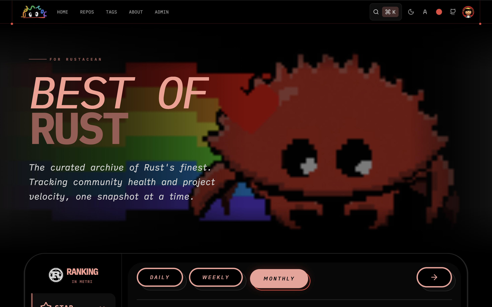
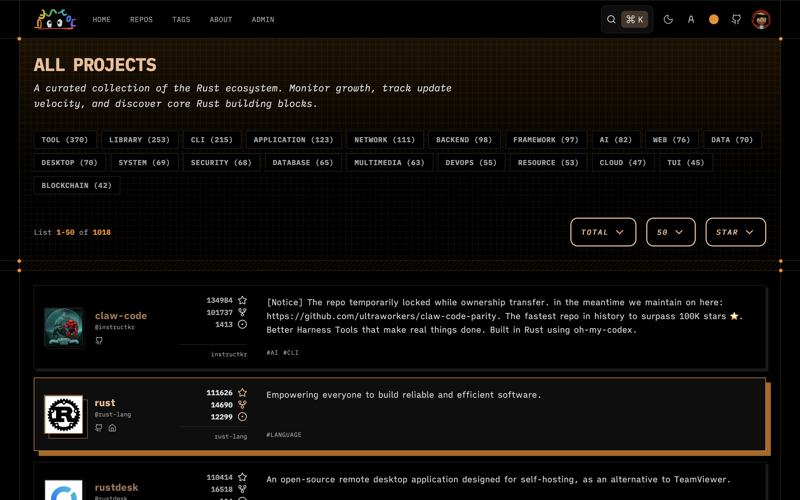
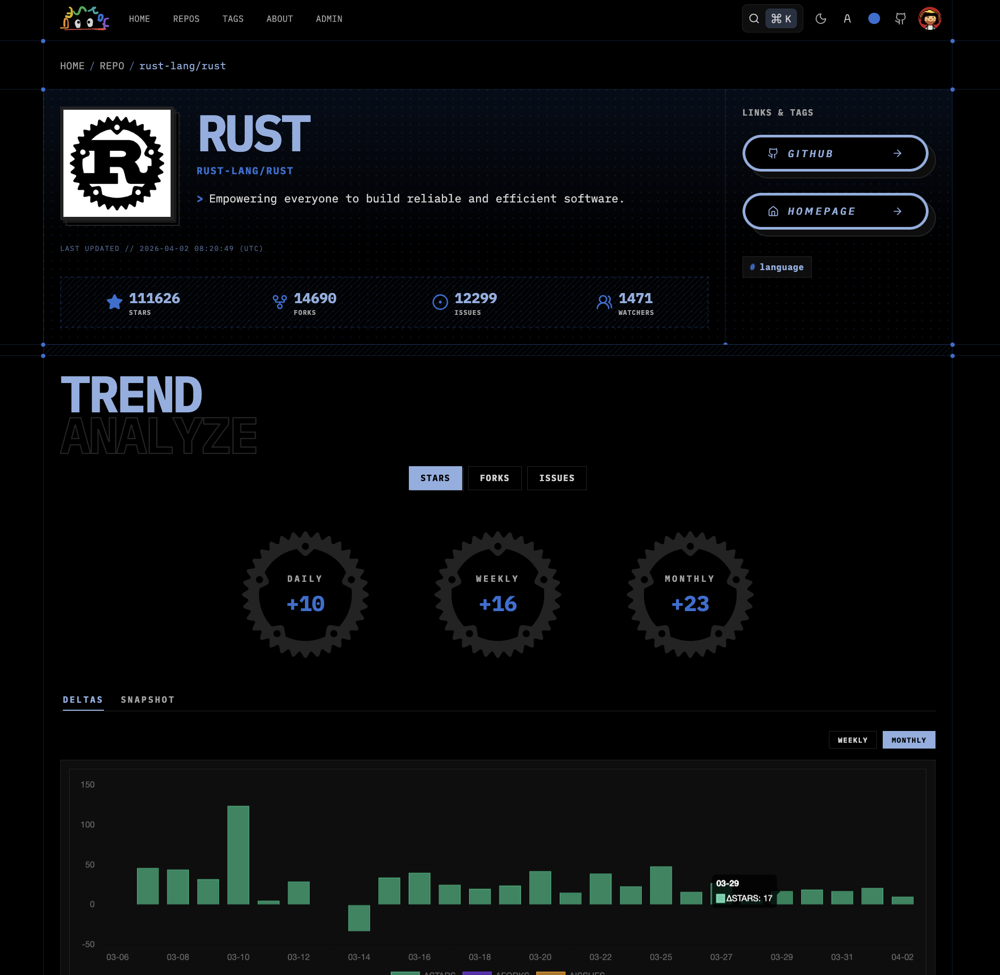
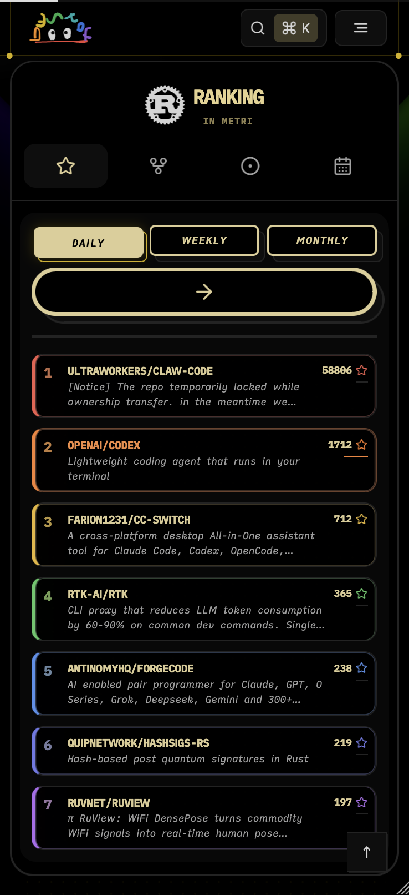
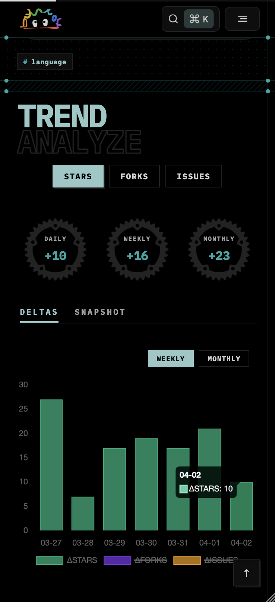
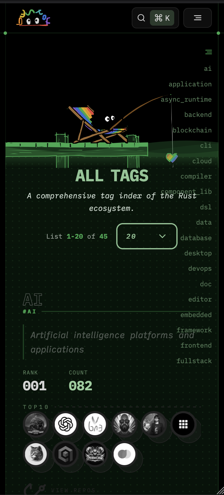
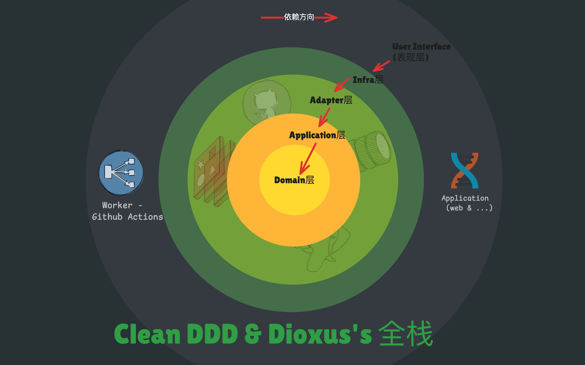

<p align="center">
  
</p>

<h1 align="center">Best Of RS</h1>

<p align="center">
  一个 <strong>更有表现力</strong> 的 Rust 生态追踪工具，用于发现、比较并持续关注开源项目趋势。
</p>

<p align="center">
  <a href="#关于">关于</a>
  <span> · </span>
  <a href="#架构">架构</a>
  <span> · </span>
  <a href="#贡献">贡献</a>
  <span> · </span>
  <a href="#许可证">许可证</a>
</p>

<p align="center">
  <b>README:</b>
  <a href="../../README.md">English</a>
  <span> | </span>
  <a href="./readme_zh-CN.md">中文</a>
</p>

<p align="center">
  <b>预览图</b>
</p>

<table>
  <tr>
    <td colspan="3" align="center">
      
    </td>
  </tr>
  <tr>
    <td colspan="3" align="center">
      
    </td>
  </tr>
  <tr>
    <td colspan="3" align="center">
      
    </td>
  </tr>
  <tr>
    <td width="33.33%" align="center">
      
    </td>
    <td width="33.33%" align="center">
      
    </td>
    <td width="33.33%" align="center">
      
    </td>
  </tr>
  <tr>
    <td colspan="3" align="center">
      
    </td>
  </tr>
</table>

## 关于

Best Of RS 的本意很简单：让 Rust 开源生态的探索更生动。

项目受 **Best of JS** 启发，并完全基于 **Rust** 构建。它会追踪 **GitHub** 上精选 Rust 仓库的日常变化，并将这些变化转化为可读的趋势信息。

它主要帮助：

- *使用者* 发现活跃、上升和稳定的 Rust 项目。
- *维护者* 通过持续的增长信号判断项目动量。

这个工具聚焦项目 `metadata` 与 `community health`，并为 `daily`、`weekly`、`monthly`、`yearly` 等时段呈现生态脉搏。

## 架构

Best Of RS 由精选项目列表、日常追踪流水线与趋势展示 UI 组成。

技术架构图为：


查看详情：[Best Of RS架构文档](../architecture/architecture_zh-CN.md)

## 贡献

欢迎贡献，包括 **`project recommendations`**、**`bug reports`** 和 **`documentation improvements`**。

```text
推荐贡献方向：
- project recommendations
- bug reports
- documentation improvements
```

查看详情：[Contribution Guide](../contribute/contribute_zh-CN.md)

## 许可证

本仓库源代码采用 **`MIT`** 许可证（见 [LICENSE](../../LICENSE)）。

但以下内容 **不** 在 **`MIT`** 许可证授权范围内，且为保留项：

- 项目名称：`Best Of RS`（及任何易混淆近似名称）
- Logo、图标与品牌标识
- 视觉设计资源（包括但不限于图片、插画与营销素材）
- 网站整体视觉与 UI 作品（如适用）

未经项目所有者事先书面许可，不得使用上述保留项暗示背书、关联，或构建易混淆的相似服务。

如需使用任何保留项，请联系：[zhiyanzhaijie](https://github.com/zhiyanzhaijie)

### 说明

- 本网站使用 **iA Writer** 字体，来源 [iA-Fonts](https://github.com/iaolo/iA-Fonts)，许可证为 **SIL Open Font License 1.1 (`OFL-1.1`)**。
